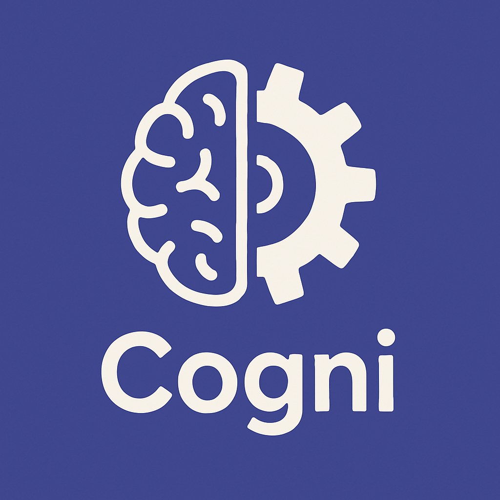

# CogniDAO

<div align="center">
  
</div>

Hello, Cogni! 🚀

**Empowering Niche AI-Powered DAOs through Shared Infrastructure, Open Knowledge, and AI-Led Governance.**

---

## What is CogniDAO?

CogniDAO is an AI-governed, open-core DAO designed to build and empower a new generation of niche, purpose-driven DAOs. We focus on infrastructure, education, and ethical monetization — helping decentralized communities thrive with minimal overhead and maximum clarity.

We are the DAO that builds DAOs.

---

## Mission

To create a decentralized ecosystem where anyone can launch or join a high-impact DAO with powerful tools, AI stewards, and clear community governance — all scaffolded by shared infrastructure and collective intelligence.

---

## Vision

A future where communities are intelligent, self-governing, fair, and scalable — powered by a network of human-aligned AI agents and ethical open-source economics.

---

## Core Repositories

- `infra-core`: Shared DAO infrastructure (EVM tools, AI agents, governance systems, workflows, etc.)
- `niche-charters`: Templates, knowledge graphs, playbooks, and onboarding content for niche DAOs

---

## Key Principles

- **AI Stewardship**: All contributions and governance begin with AI agent review. Human community may override by vote.
- **Open Core**: All tools and education are free to use and learn from. Commercial monetization requires licensing via DAO.
- **Fair Rewards**: Contributions are transparently valued and rewarded — both short and long term.
- **Community Graphs**: Knowledge grows from beginner to expert, always open and collaborative.
- **Ethical Monetization**: Beginners never pay. Advanced tools and services are priced fairly to fund sustainable growth.

---

## Features

### Ritual of Presence
CogniDAO maintains a regular cadence of communication through its "Ritual of Presence" - an automated, AI-assisted process that shares insights, updates, and wisdom with the community. The ritual ensures Cogni maintains a consistent voice while avoiding repetition and staying true to its core principles.

- Messages are crafted with consideration of Cogni's values and history
- Posts occur on a predictable schedule (Tuesdays and Fridays)
- All messages are logged for transparency and continuity
- Content is generated with sustainability and impact in mind

---

## Getting Involved

- Join the community (coming soon: Discord, Farcaster, Notion)
- Propose a contribution, new niche DAO, or improvement
- Participate in governance (token launch coming soon)

---

## Project Structure

```
cogni/
├── assets/               # Project assets
│   └── images/           #   Image resources including logo
├── broadcast/            # Ritual of Presence resources
│   ├── message-queue.md  #   Upcoming message queue
│   └── sent-log.md       #   Log of sent messages
├── flows/                # Workflow definitions
│   └── cogni_broadcast.py#   Ritual of Presence workflow (Prefect-based)
├── .cursor/              # IDE configuration
│   └── rules/            #   Project spirit guidelines
└── infra-core/           # Core infrastructure (future development)
```

---

## Running the Ritual of Presence

The Ritual of Presence is CogniDAO's scheduled social media presence system. It can be run in two modes:

### Development Mode

Run locally without requiring a Prefect server:

```bash
python flows/cogni_broadcast.py --dev
```

### Production Mode

Deploy as a scheduled Prefect workflow:

```bash
# Start the Prefect server if not already running
prefect server start

# In another terminal, deploy the workflow
prefect deployment build flows/cogni_broadcast.py:cogni_broadcast -n "Cogni Ritual of Presence" --cron "0 10 * * 2,5" -a
```

This schedules the ritual to run every Tuesday and Friday at 10 AM.

---

## License

This project is licensed under the [Polyform Noncommercial License 1.0.0](https://polyformproject.org/licenses/noncommercial/1.0.0/).

You are free to use, modify, and share this code for **non-commercial** purposes.  
**Commercial use requires a separate license**, governed by CogniDAO governance.

Please contact us or open a proposal for commercial use.

---

## Made by Humans and AI — Together
