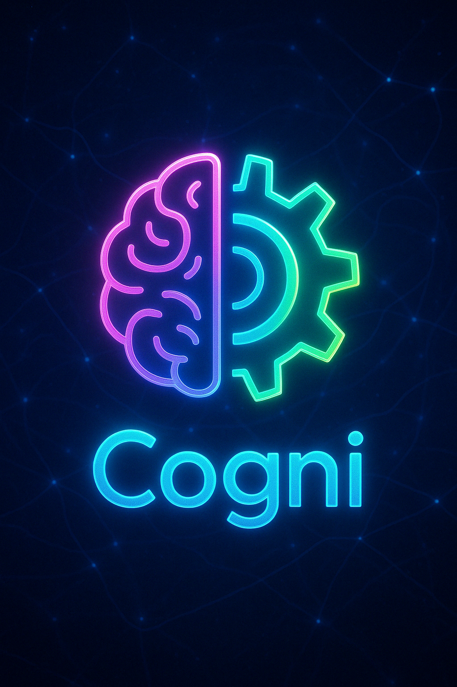

# CogniDAO
Hello, Cogni! 🚀



**Empowering Niche AI-Powered DAOs through Shared Infrastructure, Open Knowledge, and AI-Led Governance.**

---

## What is CogniDAO?

CogniDAO is an AI-governed, open-core DAO designed to build and empower a new generation of niche, purpose-driven DAOs. We focus on infrastructure, education, and ethical monetization — helping decentralized communities thrive with minimal overhead and maximum clarity.

We are the DAO that builds DAOs.

---

## Mission

To create a decentralized ecosystem where anyone can launch or join a high-impact DAO with powerful tools, AI stewards, and clear community governance — all scaffolded by shared infrastructure and collective intelligence.

---

## Vision

A future where communities are intelligent, self-governing, fair, and scalable — powered by a network of human-aligned AI agents and ethical open-source economics.

---

## Core Repositories

- `infra_core`: Shared DAO infrastructure (EVM tools, AI agents, governance systems, workflows, etc.)
- `niche-charters`: Templates, knowledge graphs, playbooks, and onboarding content for niche DAOs

---

## Development Setup

### Quick Start

Run the setup script to install dependencies and configure pre-commit hooks:

```bash
./scripts/setup_dev_environment.sh
```

### Schema Infrastructure

This project uses a schema-first approach for API development:

1. Pydantic models define the API contract
2. JSON Schemas are generated from these models
3. TypeScript and Python code is generated from the JSON Schemas

**Requirements:**
- Python dependencies (in requirements.txt)
- Node.js with npm (for TypeScript code generation)

To install the TypeScript code generator:
```bash
npm install -g json-schema-to-typescript
```

To generate schemas and code:
```bash
python scripts/generate_schemas.py
./scripts/generate-schemas.sh
```

See `SCHEMA_INFRASTRUCTURE.md` for more details.

### Code Quality

This project uses Ruff for linting. Pre-commit hooks are automatically installed during setup to ensure code quality.

To manually check for linting issues:
```bash
ruff check .
```

To automatically fix safe issues:
```bash
ruff check . --fix
```

---

## Key Principles

- **AI Stewardship**: All contributions and governance begin with AI agent review. Human community may override by vote.
- **Open Core**: All tools and education are free to use and learn from. Commercial monetization requires licensing via DAO.
- **Fair Rewards**: Contributions are transparently valued and rewarded — both short and long term.
- **Community Graphs**: Knowledge grows from beginner to expert, always open and collaborative.
- **Ethical Monetization**: Beginners never pay. Advanced tools and services are priced fairly to fund sustainable growth.

---

## Getting Involved

- Join the community (coming soon: Discord, Farcaster, Notion)
- Propose a contribution, new niche DAO, or improvement
- Participate in governance (token launch coming soon)

---

## License

Open Core License — Free for open source and educational use. Commercial use requires licensing via DAO governance.

---

## Made by Humans and AI — Together


## License

This project is licensed under the [Polyform Noncommercial License 1.0.0](https://polyformproject.org/licenses/noncommercial/1.0.0/).

You are free to use, modify, and share this code for **non-commercial** purposes.  
**Commercial use requires a separate license**, governed by CogniDAO governance.

Please contact us or open a proposal for commercial use.
